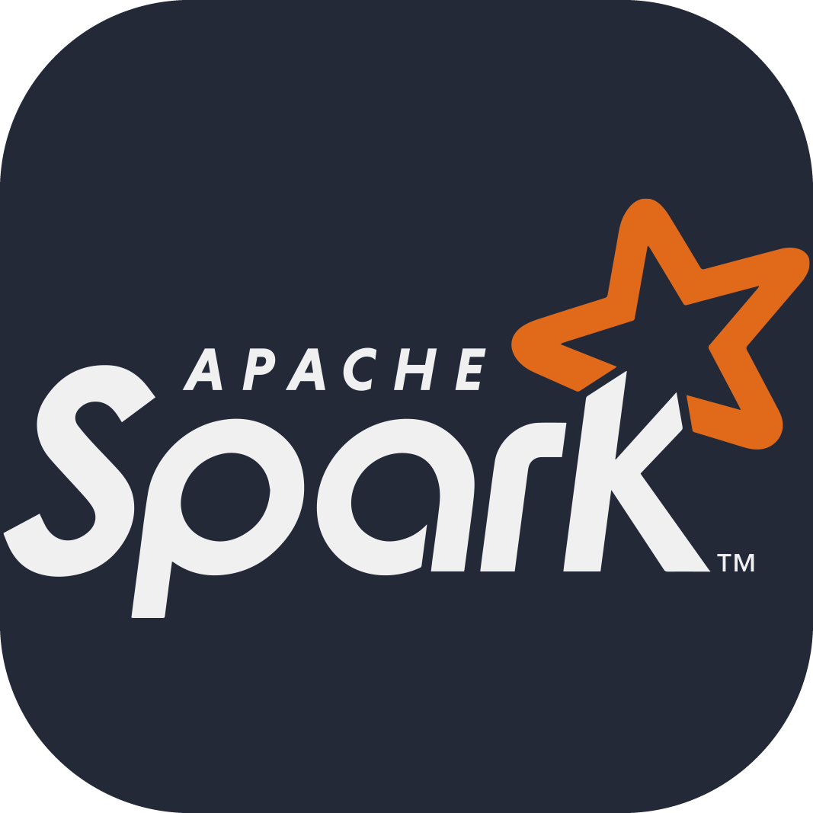

<h1>Lomri Moncef  <a href="https://github.com/joshmadakor1">Web developper</a>, <a href="https://www.linkedin.com/in/joshmadakor/">Computer science engineer</a></h1>

<h2>👨‍💻 Software Development Projects:</h2>

[twitter]: https://twitter.com/joshmadakor
[youtube]: https://www.youtube.com/c/joshmadakor
[instagram]: https://www.instagram.com/joshmadakor/
[linkedin]: https://linkedin.com/in/joshmadakor

<h3 align="center">Full-stack web developer with a passion for software architecture and programming best practices. Over the last 8 years, I have developed and maintained complex Web apps using mainly Laravel and Vue. I love writing clean code and talking and writing about it .

</h3>

<h2>👨‍💻 Software Development Projects:</h2>

## Language and Tools

#### Main Stack:
  
  
  
  
    
  
    
        

#### Studying in this moment:
  
  
  

- 🔭 I’m currently working in <a href="https://phoenix.tech/griffyn/" target="blank">Griffyn Robotech Private Limited</a>

- 🌱 I’m currently Working on Mobile App(React-Native)

- 🤝 I’m available for freelancing.

- 🌱 I’m currently learning Swift && SwiftUI <a href="https://github.com/100rabhcsmc/100DaysOfSwift" target="blank">100DaysOfSwift</a>

- 📝 I regularly write articles on [https://dev.to/100rabhcsmc](https://dev.to/100rabhcsmc)

- 💬 Ask me about **Reactjs & React-Native**

- 📫 How to reach me **saurabhchavan052@gmail.com**

- 📄 Know about my experiences <a href="https://github.com/100rabhcsmc/Me.io/blob/master/01SaurabhChavanReactNativeResume.pdf" target="blank">Resume</a>
 
<h3 align="center" > Connect with me 🤝 </h3>

 

        
        
	   		
      

### Blogs posts

<!-- BLOG-POST-LIST:START -->

- [Download Instagram profile picture using python](https://dev.to/100rabhcsmc/instagram-profile-picture-download-using-python-n2j)
- [Convert a image to sketch using python](https://dev.to/100rabhcsmc/convert-a-image-to-sketch-using-python-3ip1)
- [Upload your project/files in GitHub using commands](https://dev.to/100rabhcsmc/upload-your-project-files-in-github-using-commands-1hn8)
<!-- BLOG-POST-LIST:END -->

---

